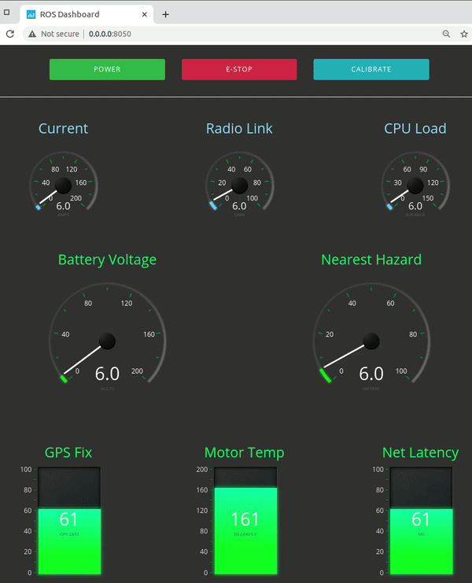
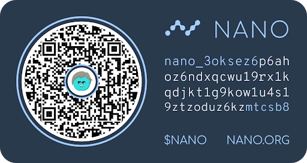

# ROS Dashboard
# A Web-Based Control Panel & Dashboard for Visualizing ROS Data 
- This browser-based dashboard can be viewed from any browser, but is designed for use with a touchscreen on-board a robot.
- The client performs reasonably well when viewed via the Chromium browser on a Raspberry Pi 4 with 10.1" touchscreen 
- The server code `ros_dashboard.py` was tested on an x86 laptop running Ubuntu 16.04 and Python 2.7

# Quickstart on Ubuntu 18.04, ROS 1 (Melodic), Python 2.7

0. Install [ROS](http://wiki.ros.org/ROS/Installation) :)

1. Clone the code:

    `$ git clone https://gitlab.com/chambana/ros-dashboard.git`     

2. Install the Python dependencies:

    `$ cd ros-dashboard`     
    `~/ros-dashboard$ sudo pip install -r requirements.txt`     

3. Open a terminal window and start ROS master:
   
    `$ roscore`     
    
     _(don't close this window)_

4.  Open a 2nd terminal window and run the fake data publisher:

    `$ python dummy_pub.py`

     _(You should see streaming values.  Don't close this window)_

5.  Open a 3rd terminal window and run the ROS Dashboard:
    
    `$ python ros_dashboard.py`

    _(you should see some initialization text. Don't close this window)_

6.  Open a web browser go to this URL:

    `http://0.0.0.0:8050/`

    _(You should see the dashboard graphic depicted above:)_

7.  To view the ROS Dashboard on a Raspberry Pi 4, open a Chromium browser on the Pi and replace the 0.0.0.0 IP address with the IP address of the computer running the `ros_dashboard.py` code

# Setup Raspberry Pi 4 as an onboard control panel and dashboard
    
1.  Buy this 10.1" touchscreen for $69.52. It's powered by the Pi 4's 5V USB port and works without additional drivers.
            
    [10.1" HDMI Touchscreen for Raspberry Pi 4](https://www.aliexpress.com/item/1005001579843497.html)
        
2.  Configure the 10.1" touchscreen for vertical orientation display and vertical touch input
  
    [Complete the steps in the section labeled Rotation](https://www.waveshare.com/wiki/10.1inch_HDMI_LCD_(E))

3.  Configure the Pi 4 to automatically load the fullscreen ROS dashboard on startup:
    
    Edit the autostart file:
    
    `$ nano /home/pi/.config/lxsession/LXDE-pi/autostart`
    
    add this line:
    
    `@chromium-browser --kiosk 0.0.0.0:8050`  
    (replace 0.0.0.0 with the IP of the computer running `ros_dashboard.py`)

4.  Overclock your Pi 4 to 2GHz

    [Guide](https://magpi.raspberrypi.org/articles/how-to-overclock-raspberry-pi-4)
  
5.   Example performance of ROS Dashboard running on Raspberry Pi 4 w/touchscreen:

# How to configure the dashboard for your own robot
- Simply edit the config.json file to match the ROS topics, messages types, and visualization text for your robot.

# Example Button Config in the config.json file:
    
**"button_1": {**   _`[Don't edit the button id]`_

   **"enabled": true,**  _`[Set to true or false depending on whether you want to display this button]`_
   
   **"trigger_service_to_invoke": "/robot_services/on_off_toggle",** _`[Set to an existing ROS Trigger Service running on your robot]`_
   
   **"visualization_description": "Power"** _`[Set to a text label you want to display on this button]`_

**},**

# Example Visualization Config in the config.json file:

**"fast_rate_small_circular_gauge_1": {**  _`[Don't edit the visualization id]`_
    
**"enabled": true,** _`[Set to true or false depending on whether you want to display this visualization]`_
    
**"topic_name": "/robot_stats/battery_load",** _`[Set to an existing ROS Topic. This topic's data will populate this visualization]`_
    
**"ros_message_type": "sensor_msgs/BatteryState",**_`[Set to the ROS message type transmitted on the ROS Topic above]`_
    
**"field_name": "current",** _`[Set to the name of the specific field to pull data from in the ROS message type above]`_
    
**"visualization_label" : "Robot Power",** _`[Set to the text you want to display on top of this visualization]`_
    
**"visualization_units": "Amps",**  _`[Set to the text you want to display as the units of measure for this visualization]`_
    
**"mininum_value": 0,**  _`[Set to the minimum value for data populating this visualization]`_
    
**"maximum_value": 200**  _`[Set to the maximum value for data populating this visualization]`_
    
**},**

# Performance on various hardware

**- Raspberry Pi 3B**

---

**- Jetson Nano 2GB**

---

**- Dell XPS15 laptop**

---

**- Raspberry Pi 4**

---

**- Three simultaneous ROS Dashboards clients (Pi 4, Jetson, Laptop) and 1 server**

---

# Contribute some NANO if this was useful

